# 英语学习APP

## 一、加入项目

1.首先再电脑任意位置新建一个名叫`gitee`文件夹，用于存放的仓库。

2.进入`gitee`目录并打开Git Bash，复制远程仓库的https链接。

然后直接执行`git clone`

> 仓库分支

master:主分支，项目可靠已经完成的功能代码。

dev:开发分支，每次提交首先提交的分支，确认无误再合并到master分支。

3.设置本地仓库分支与远程仓库保持一致

至此，设置完成然后可以对项目进行开发了！

---

例：对仓库文档修改/添加并提交远程仓库，再合并dev分支。

先push到dev分支

现在打开gitee，可以看到dev分支有test.txt文件，而master分支没有，dev比master优先一个版本。

然后将dev合并到master

master分支要合并dev分支就要先切换到master操作

查看远程仓库，两个分支数据同步了。

大功告成！！

> 以后使用可能会出现错误

原因是因为有其它成员修改了远程仓库，而你的本地仓库没同步上。git push 推送内容时就会报错。因此要先`git pull`拉取内容同步上。

解决办法：

避免：每次push前都应pull拉取一下。

## 二、业务分析

### 功能需求图

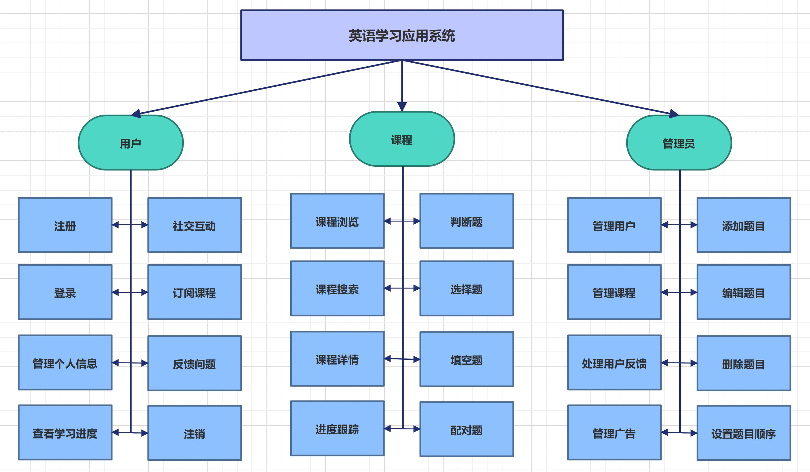

### 数据流图

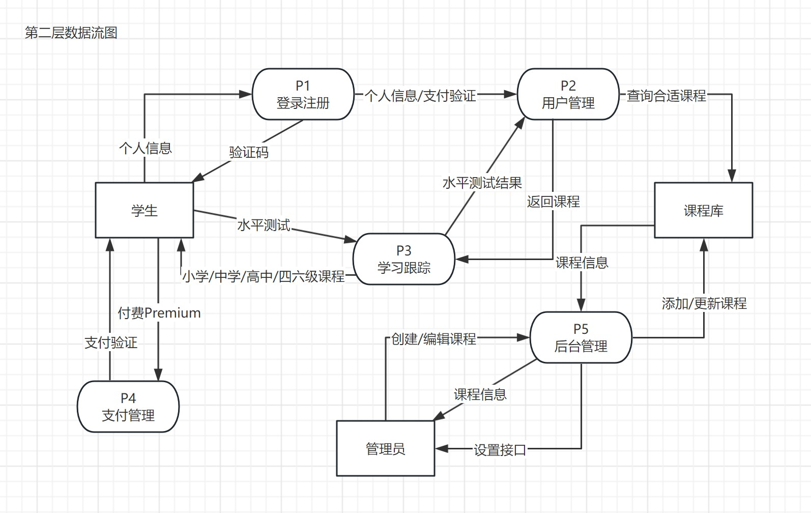

### 业务流程图

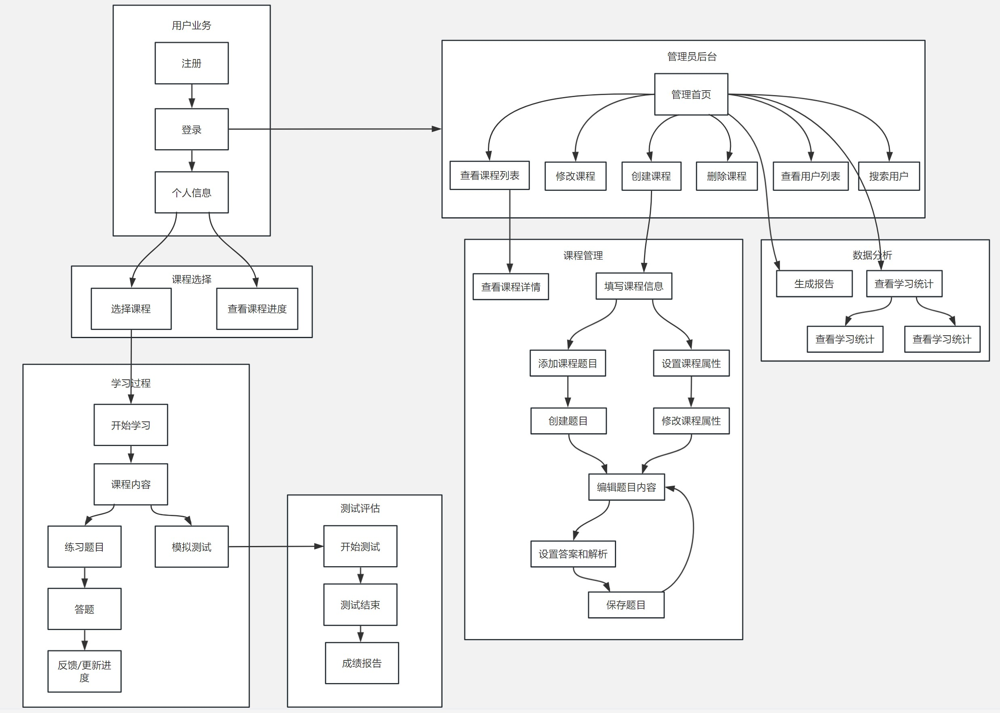

## 三、项目架构

### 微信小程序前端目录

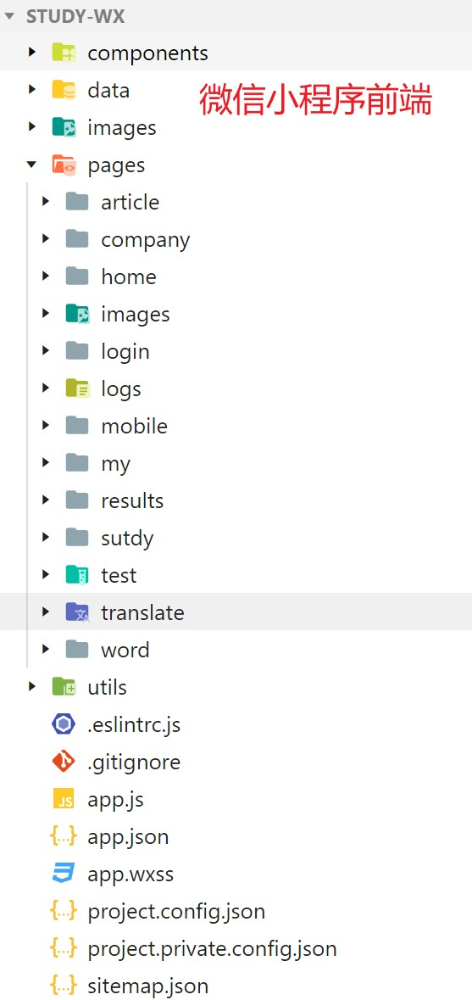

### 管理员前端

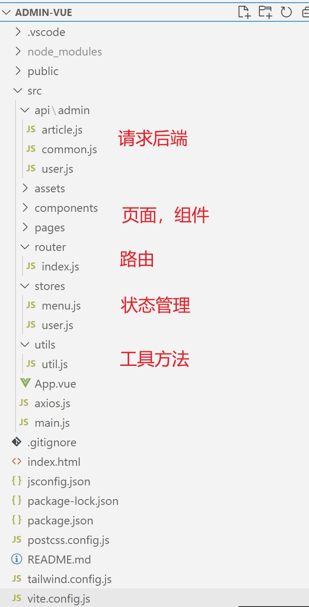

### 后端目录

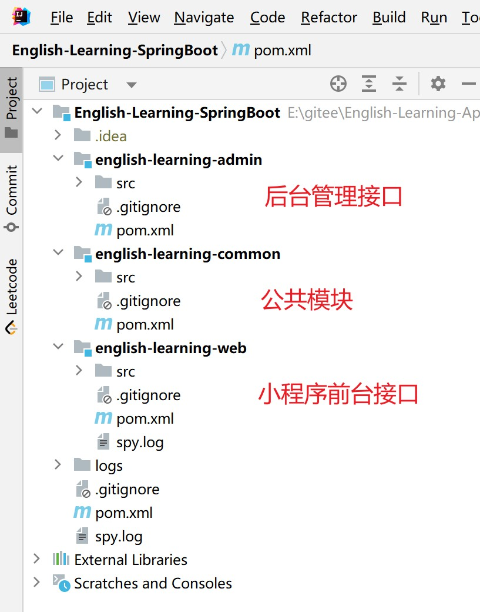

## 四、页面展示

### 管理员页面

**发布文章**

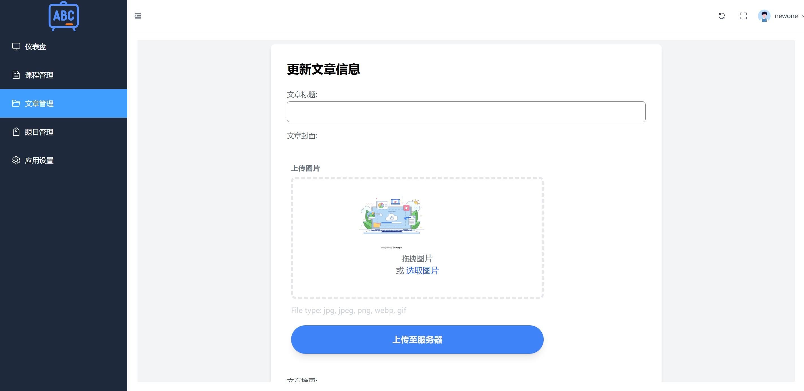

### 微信小程序

**首页**

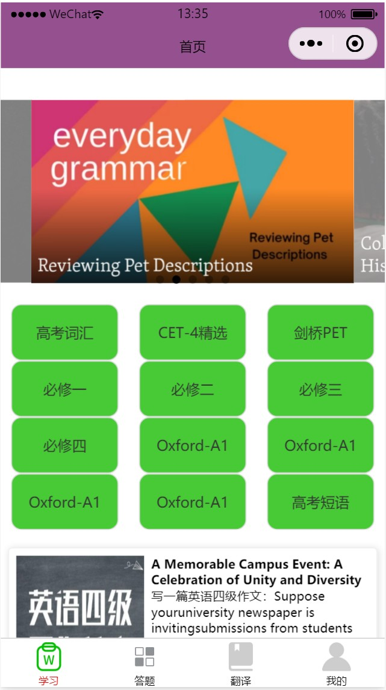

**文章阅读**

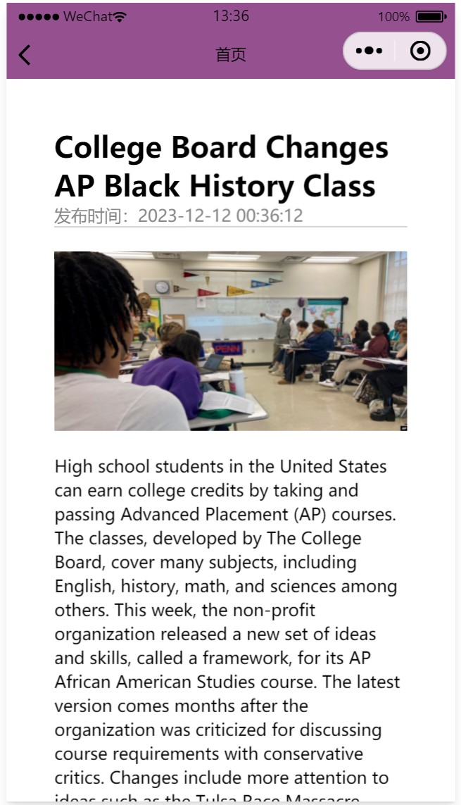

**答题学习**

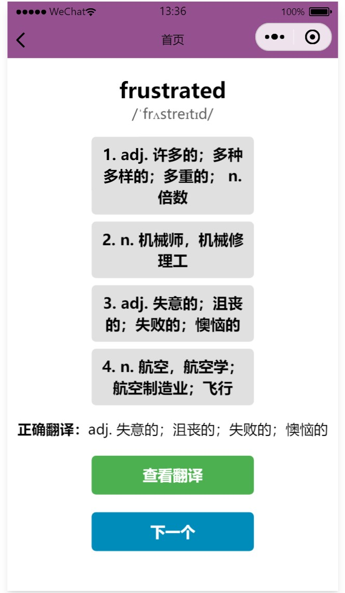

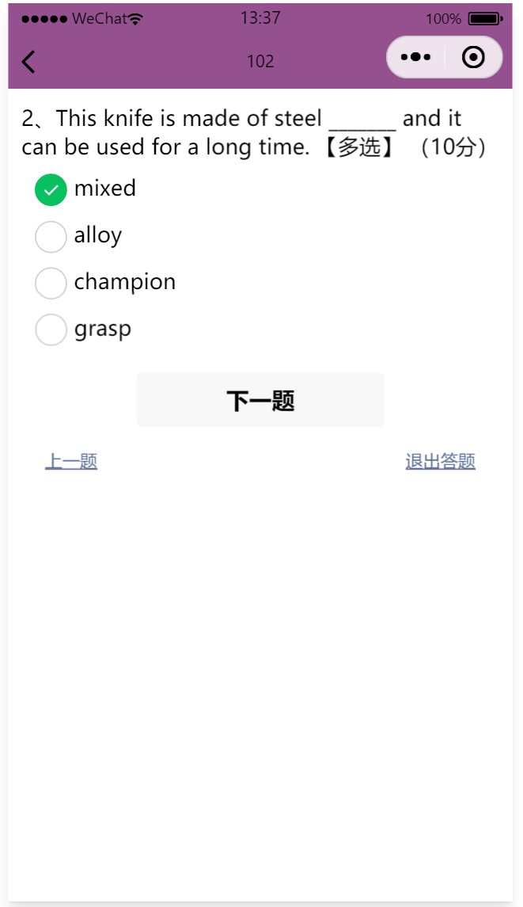

**翻译**

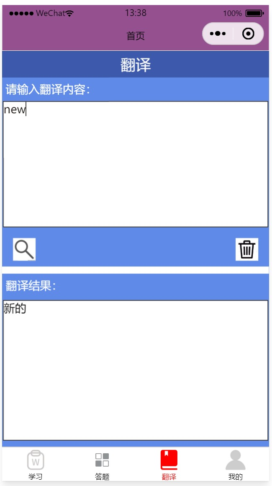

**个人中心**

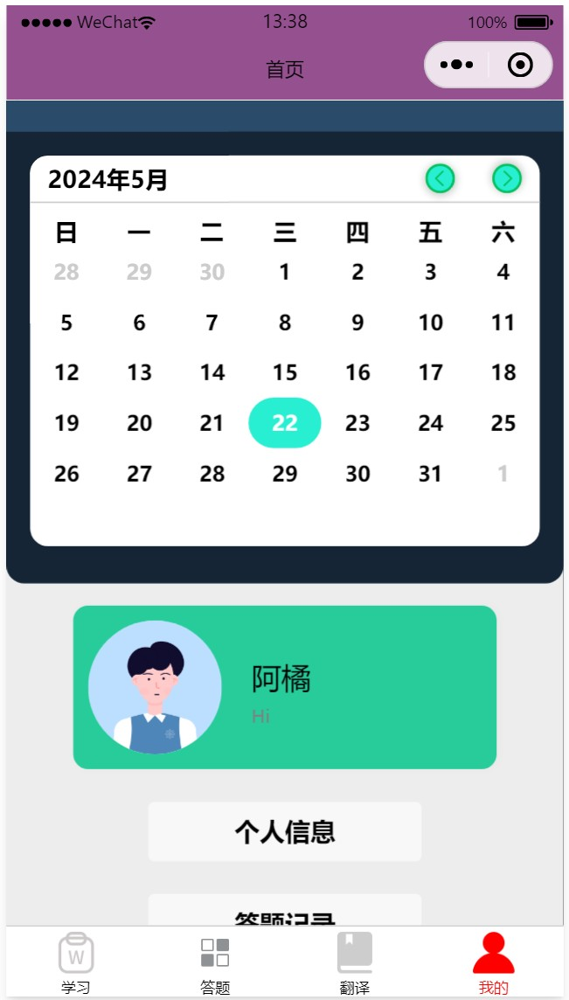